# External Dependency Graph

Generated from `pyproject.toml` cross-referenced against actual imports under
`evalbench/`. Each edge is a real import path in the code — deps with no
incoming edge are unused-by-evalbench (none currently).

## Graph

```mermaid
graph LR
    %% ============= Evalbench internal packages =============
    subgraph EVB ["evalbench/"]
        GEN_SDK[generators/models<br/>SDK judges]
        GEN_AGENT[generators/models<br/>agent CLIs]
        GEN_DEA[generators/models<br/>data_engineering_agent.py<br/>query_data_api.py]
        DB[databases/]
        DBUTIL[databases/util.py]
        SCORE[scorers/<br/>dbtscorer.py]
        REPORT[reporting/<br/>gcs_artifact.py]
        SESSION[util/session.py]
        EVALBENCH[evalbench.py<br/>util/sanitizer.py<br/>etc.]
    end

    %% ============= External dep groups =============
    subgraph LLM ["LLM SDKs"]
        GENAI[google-genai]
        ANTHROPIC["anthropic[vertex]"]
        A2A["a2a-sdk &ge;1.0.3"]
        ADK[google-adk]
        GDA["google-cloud-geminidataanalytics<br/>&ge;0.11.0"]
    end

    subgraph GCP ["GCP services"]
        SPANNER[google-cloud-spanner]
        SQLA_SP[sqlalchemy-spanner]
        BIGTABLE[google-cloud-bigtable]
        SECRETS[google-cloud-secret-manager]
        FIRESTORE[google-cloud-firestore]
        STORAGE[google-cloud-storage]
        IAM[google-cloud-iam]
        ALLOY["google-cloud-alloydb-connector<br/>[pg8000]"]
        CSQL_PG["cloud-sql-python-connector<br/>[pg8000]"]
        CSQL_TDS["cloud-sql-python-connector<br/>[pytds]"]
        PGBQ[pandas-gbq]
    end

    subgraph SQL ["DB drivers / ORM"]
        SQLA[sqlalchemy]
        SQLA_TDS[sqlalchemy-pytds]
        PYMYSQL[pymysql]
        PYMONGO[pymongo]
        MONGOMOCK[mongomock]
        REDIS[redis]
    end

    subgraph PARSE ["SQL parsing"]
        SQLGLOT[sqlglot]
        SQLPARSE[sqlparse]
    end

    subgraph DBT ["dbt"]
        DBT_CORE[dbt-core]
        DBT_BQ[dbt-bigquery]
        DBT_PG[dbt-postgres]
    end

    subgraph DATA ["Data processing"]
        PANDAS[pandas]
        ARROW[pyarrow]
        PROTO[protobuf]
    end

    subgraph INFRA ["Infra / runtime"]
        GRPC[grpcio &ge;1.80]
        GRPCT[grpcio-tools]
        JSCHEMA[jsonschema]
        RL[ratelimit]
        BACKOFF[backoff]
        AIOLOG[aiologger]
        YAMLENV[pyaml_env]
        ABSL[absl-py]
        GITPY[GitPython]
        RICH[rich]
        TAB[tabulate]
    end

    subgraph DEV ["Dev only"]
        PYCS["pycodestyle &ge;2.14"]
        PYTEST["pytest &ge;8.0"]
    end

    %% ============= Edges =============
    GEN_SDK --> GENAI
    GEN_SDK --> ANTHROPIC

    GEN_AGENT --> STORAGE
    GEN_AGENT -. shell-out .-> GENAI

    GEN_DEA --> A2A
    GEN_DEA --> GDA

    DB --> SQLA
    DB --> SQLA_SP
    DB --> SQLA_TDS
    DB --> SPANNER
    DB --> BIGTABLE
    DB --> PYMYSQL
    DB --> PYMONGO
    DB --> MONGOMOCK
    DB --> ALLOY
    DB --> CSQL_PG
    DB --> CSQL_TDS
    DB --> PGBQ

    DBUTIL --> SECRETS
    DBUTIL --> REDIS

    SCORE --> DBT_CORE
    SCORE --> DBT_BQ
    SCORE --> DBT_PG

    REPORT --> STORAGE

    SESSION --> FIRESTORE
    SESSION --> STORAGE
    SESSION --> ADK

    EVALBENCH --> SQLGLOT
    EVALBENCH --> SQLPARSE
    EVALBENCH --> PANDAS
    EVALBENCH --> ARROW
    EVALBENCH --> PROTO
    EVALBENCH --> GRPC
    EVALBENCH --> GRPCT
    EVALBENCH --> JSCHEMA
    EVALBENCH --> RL
    EVALBENCH --> BACKOFF
    EVALBENCH --> AIOLOG
    EVALBENCH --> YAMLENV
    EVALBENCH --> ABSL
    EVALBENCH --> GITPY
    EVALBENCH --> RICH
    EVALBENCH --> TAB
    EVALBENCH --> IAM

    classDef internal fill:#dbeafe,stroke:#1e40af,color:#1e3a8a
    classDef llm fill:#fef3c7,stroke:#b45309,color:#78350f
    classDef gcp fill:#d1fae5,stroke:#047857,color:#064e3b
    classDef sql fill:#ede9fe,stroke:#6d28d9,color:#4c1d95
    classDef parse fill:#fce7f3,stroke:#be185d,color:#831843
    classDef dbt fill:#ffedd5,stroke:#c2410c,color:#7c2d12
    classDef data fill:#f3f4f6,stroke:#4b5563,color:#1f2937
    classDef infra fill:#e0f2fe,stroke:#0369a1,color:#0c4a6e
    classDef dev fill:#f5f5f4,stroke:#78716c,color:#44403c

    class GEN_SDK,GEN_AGENT,GEN_DEA,DB,DBUTIL,SCORE,REPORT,SESSION,EVALBENCH internal
    class GENAI,ANTHROPIC,A2A,ADK,GDA llm
    class SPANNER,SQLA_SP,BIGTABLE,SECRETS,FIRESTORE,STORAGE,IAM,ALLOY,CSQL_PG,CSQL_TDS,PGBQ gcp
    class SQLA,SQLA_TDS,PYMYSQL,PYMONGO,MONGOMOCK,REDIS sql
    class SQLGLOT,SQLPARSE parse
    class DBT_CORE,DBT_BQ,DBT_PG dbt
    class PANDAS,ARROW,PROTO data
    class GRPC,GRPCT,JSCHEMA,RL,BACKOFF,AIOLOG,YAMLENV,ABSL,GITPY,RICH,TAB infra
    class PYCS,PYTEST dev
```



## Notes

- **Agent CLIs** (`gemini_cli`, `claude_code`, `codex_cli`, `agy_cli`) shell out
  to external binaries; they don't import the SDKs directly. The dashed edge
  `agent CLIs ⇢ google-genai` shows that the *agent under test* uses Gemini
  internally, not that evalbench imports it for them.
- **`google-genai`** is consumed by both the Gemini SDK judge
  (`generators/models/gemini.py`) and indirectly by tests
  (`test/gemini_tools_test.py`).
- **`google-cloud-iam`** has no obvious consumer in `evalbench/` import
  scanning — likely pulled in transitively by other GCP SDKs or used by deploy
  tooling. Worth confirming before assuming it's load-bearing.
- **`dbt-core` + adapters** are consumed only by `scorers/dbtscorer.py` —
  pruning them would only break dbt-based scoring.
- **`mongomock`** is a test-time dependency for `databases/mongodb.py`. Listed
  in main `dependencies` rather than `dev` — worth flagging if you want to slim
  the runtime install.

## Dep groups by purpose

| Group | Purpose | If removed, what breaks |
|---|---|---|
| LLM SDKs | Direct Gemini/Claude judges + DEA agent | SDK-judged scorers, DEA generator |
| GCP services | Backend connectivity for managed DBs + storage | Spanner/BigQuery/Bigtable/AlloyDB/CloudSQL/Firestore/GCS paths |
| DB drivers | Raw drivers for self-managed DBs | Postgres/MySQL/MSSQL/Mongo backends + cache |
| SQL parsing | Pre-execution analysis (e.g. trajectory matching) | scorers that compare structural SQL |
| dbt | dbt-based scoring | `dbtscorer` only |
| Data processing | Result-set handling | Most CSV/Parquet reporting paths |
| Infra | Cross-cutting (RPC, rate limiting, logging) | Most things — these are foundational |
| Dev | Linting + tests | CI; not runtime |

## Surfacing supply-chain risk

For a quick sweep of high-blast-radius deps:

```bash
# Direct deps only (not transitive)
grep -A 100 '^dependencies = \[' pyproject.toml | sed -n 's/^    "\(.*\)",/\1/p'

# Per-package recent versions (lockfile)
grep -A1 '^name = ' uv.lock | grep -E '^(name|version)' | paste - - | head -40
```

GitHub Dependabot covers most of the CVE noise (already enabled — the recent
push showed *"3 vulnerabilities on default branch"*). The graph above tells
you which deps an unpatched CVE actually reaches in this codebase.
